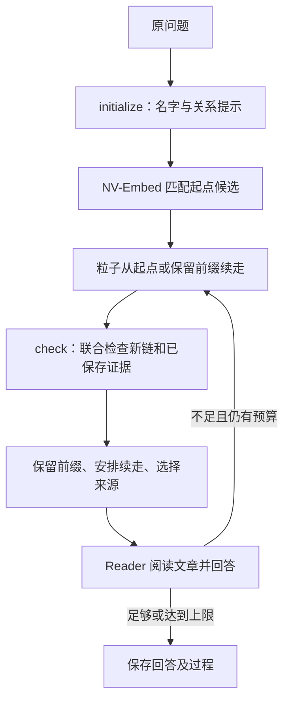

# 当前方法与代码对应

本文描述当前实现，不包含后续改进方案。构图对应历史 r4q，检索 QA 对应历史 r11。八个提示词保持逐字一致，来源哈希见 `provenance.json`。

## 构图

`ppr_graphrag/llm/joint_extraction.py` 使用一次联合调用抽取一篇文章，输入是文章标题与正文。端点带名称、语义类型和可选消歧信息。事实类型决定哪些端点进入实体图；语义类型描述对象，不能单独决定是否建节点。

| 类型 | 处理 |
|---|---|
| ENTITY_LINK | 两端是可复用实体；保留正向事实，生成可用逆向谓语后增加遍历视图 |
| ENTITY_TO_DETAIL | 实体指向终端描述；描述没有独立实体节点，不能继续游走 |
| DETAIL_TO_ENTITY | 原方向为描述指向实体；有逆向表达时转为实体指向描述的终端边，否则保留文本记录 |
| TEXT_FACT | 独立事实文本，进入 dense 记录 |
| SAME_ENTITY | 原文支持的身份或别名关系，供归并使用 |

限定信息、原事实和文章来源保存在图中。逆向视图与原事实共享事实身份。终端事实不生成从终端值出发的逆向遍历边。

`ppr_graphrag/graph/alignment.py` 和 `ppr_graphrag/graph/assembly.py` 维护文章内局部实体、跨文章候选及最终节点映射。向量候选阈值为 0.80，使用 complete-link 一致性；不同名称候选通过 `ppr_graphrag/graph/identity.py` 审查。同篇文章的不同局部实体组施加不能合并的约束，并在簇合并时保留。身份审查输入名称、类型、文章标识和最多四条局部事实。

抽取结果逐条校验，允许保留部分成功事实。逆向生成按关系与带类型实例分批，局部成功结果独立保存。主要产物为 `graph.json`、局部实体及映射、名称和有向关系向量、dense 事实及向量、原始调用与状态记录。

## 检索和 QA

`ppr_graphrag/llm/chain_controller.py` 的初始化只接收原问题。对其中每个名字，名称/标题匹配优先，然后按 NV-Embed 相似度排列，按归并节点去重，保留 50 个候选。

`ppr_graphrag/retrieval/particle.py` 每轮使用 100 个粒子，每次最多续走两步，最多四轮，每个调度批次 10 个粒子。第一轮仅开放各名字前三个起点，之后开放其余候选。未尝试候选合成一个调度选项，选中后再按权重挑选。已尝试起点和续走位置根据先验及已处理的采样次数分配预算。

关系提示通过向量匹配指导边选择，阈值为 0.70。epsilon 随探索状态变化，增量 0.10、上限 0.30；关系筛选或 epsilon 变化会建立新的探索计数阶段。存在当前实体主要来源文章时，使用比例 0.50 的来源偏好。路径不重复使用同一事实，进入终端后停止。

去重后的链进入待检查池。check 输入自然语言形式的顺序三元组、已保存档案与 Reader 反馈，返回保留前缀、续走位置、完成任务及提交建议。每批最多展示 20 条新链与档案记录的合计，其中档案最多 10 条；未检查链保留到后续轮次。

归档存带来源的证据前缀，续走位置与归档分开管理。新来源包可交 Reader 检查；不足时记录反馈，并根据输出重新开放相关探索。达到轮数上限时仍保存部分证据。

Reader 输入原问题、所选链和完整来源文章；现有机制可补充参与实体的主要文章。最终来源并集最多五篇，并校验完整输入和输出预算。Reader 返回答案、证据充分性及链的判断；不足时回答 `unknown`。

当前在线流程没有接入 dense 事实召回。构图保存 dense 记录不意味着检索时使用它们。

## 模型和评测

- LLM：gpt-oss:20b，固定 digest，新请求使用 low、temperature 0、seed 0、16,384 上下文，不静默截断。
- 编码：NV-Embed-v2，revision `3fa59658547db50a1e8e3346cf057fd0c77ed6ef`，FP16、4,096 维、归一化、最大长度 2,048、空 instruction。
- 标准答案与支持文章标签只进入评测；检索入口仅接收 query ID 和 question。
- 分开记录文章召回、全部来源覆盖、Reader 判断、EM/F1、调用量和耗时。
- 提示词和核心函数保持实验快照；新启动脚本属于执行适配，未重跑 GPU 实验来重新测量分数。
